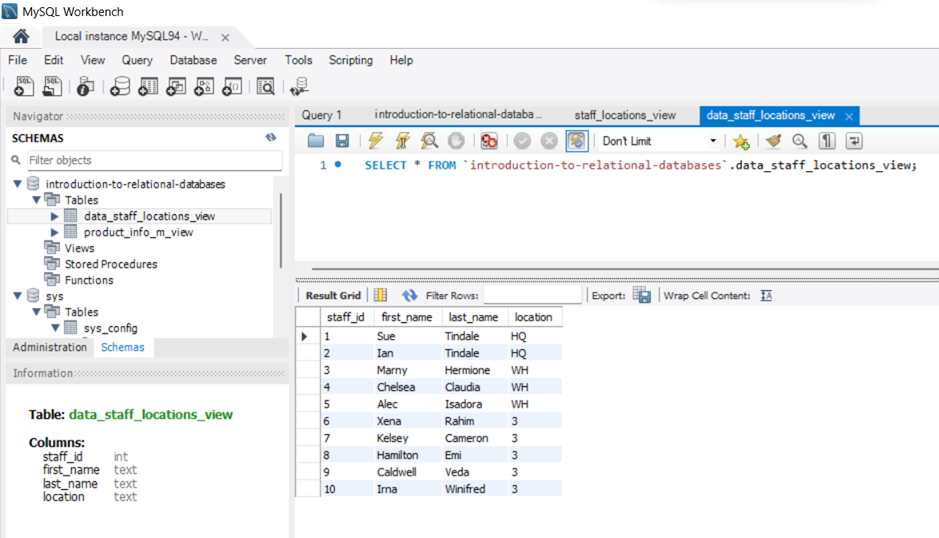

# Project Resolution

## Task 1: Upload the screenshot of the list of identified entities (Task1.jpg/png). (4pts.)

**Entities:**

- staff;
- sales_outlet;
- sales_transaction;
- customer;
- product.

## Task 2: Upload the list of attributes for the entity that will store the sales transaction data as a screenshot (Task2.jpg/png). (4 pts)

- **Sales Transaction Table Atributes**

    - transaction_id;   
    - transaction_date;
    - transaction_time;
    - sales_outlet_id	staff_id;
    - customer_id	
    - product_id;
    - quantity;
    - price.

## Task 3A: Upload the ERD diagram for the sale transactions entity using the information in the following table as a screenshot using the pgAdmin ERD Tool (Task3A.png or Task3A.jpg).  (2 pts)
 

## Task 3B: Upload the ERD diagram for the product entity using the information in the following table as a screenshot using the pgAdmin ERD Tool (Task3B.png or Task3B.jpg). (2 pts)

## Task 4A: Upload the screenshot with the normalized sales_detail table in the ERD (Task4A.png or Task4A.jpg). (2 pts)

## Task 4B: Upload the screenshot with the normalized product_type table in the ERD (Task4B.png or Task4B.jpg). (2 pts)

## Task 5A: Upload the screenshot with the primary keys in the tables in your ERD (Task5A.png or Task5A.jpg). (2 pts)

## Task 5B: Upload the screenshot with the relationships in your ERD between the following tables (Task5B.png or Task5B.jpg). (2 pts):

- sales_detail to sales_transaction

- sales_detail to product

- product to product_type 

## Task 6A: Upload the screenshot of the tables shown in the tree-view pane on the left-hand side of the page by running the SQL script from the ERD Tool. (Task6A.png or Task6A.jpg). (2 pt)

## Task 6B: Upload the screenshot of the Data Output pane of the sales_detail` table. (Task6B.png or Task6B.jpg). (2 pt)

## Task 7: Upload the screenshot of the staff-locations_view shown in the tree-view pane on the left-hand side of the page alongside the results in the Data Output pane (Task7.png or Task7.jpg). (4 pts)

## Task 8: Upload the screenshot of the materialized view, product_info_m-view, shown in the tree-view pane on the left-hand side of the page, with the results in the Data Output pane. (Task8.png or Task8.jpg) (4 pts)

## Task 9: Upload the screenshot of the imported staff_location data into a MySQL database. (Task9.png or Task9.jpg) (4 pts)

## Task 10: Upload the screenshot of the imported coffee_shop_products data into a MySQL database. (Task10.png or Task10.jpg) (1 pt)

